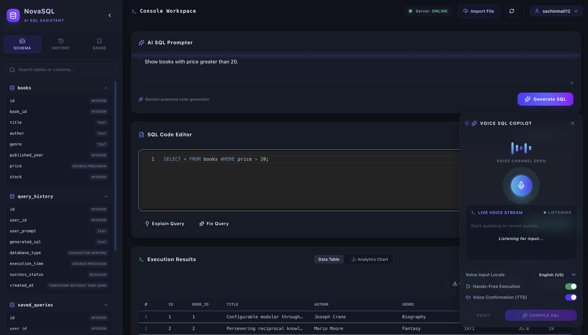

# 🚀 NeuroQuery - AI Powered SQL Assistant

<div align="center">


💡 Convert Natural Language into SQL Queries using AI

🎤 Voice SQL Copilot • 📊 Analytics • ⚡ Fast Execution • 🧠 AI Query Generation

</div>

---

# ✨ Features

✅ AI-Powered SQL Query Generation  
✅ Voice SQL Copilot 🎤  
✅ SQL Code Editor  
✅ Query Explanation System  
✅ Auto Fix SQL Queries  
✅ Database Schema Explorer  
✅ Query History Tracking  
✅ Saved Queries Feature  
✅ CSV/Excel File Import  
✅ Analytics Chart Visualization 📈  
✅ Dark Modern UI 🌙  
✅ FastAPI + React Architecture ⚡  
✅ Docker Support 🐳

---

# 🖼️ Preview

## 🧠 AI SQL Workspace

<p align="center">
  
</p>
---

# 🛠️ Tech Stack

## Frontend 🎨
- React.js
- Tailwind CSS
- Monaco Editor
- Framer Motion

## Backend ⚙️
- FastAPI
- Python
- SQLAlchemy
- PostgreSQL

## AI Integration 🤖
- GroqCloude API
- NLP Query Processing

## Deployment 🚀
- Docker
- Docker Compose

---

# 📂 Project Structure

```bash
NeuroQuery/
│
├── backend/
│   ├── app/
│   ├── requirements.txt
│   ├── Dockerfile
│   └── .env
│
├── frontend/
│
├── docker-compose.yml
├── README.md
└── .gitignore
```

---

# ⚙️ Installation

## 1️⃣ Clone Repository

```bash
git clone https://github.com/sachinmali12/NeuroQuery.git
```

---

## 2️⃣ Move Into Project

```bash
cd NeuroQuery
```

---

## 3️⃣ Backend Setup

```bash
cd backend

python -m venv venv

source venv/bin/activate
```

### Install Dependencies

```bash
pip install -r requirements.txt
```

---

# 🔐 Environment Variables

Create `.env` file inside backend folder.

```env
DATABASE_URL=your_database_url
GEMINI_API_KEY=your_api_key
```

---

# ▶️ Run Backend

```bash
uvicorn app.main:app --reload
```

---

# 💻 Frontend Setup

```bash
cd frontend

npm install

npm run dev
```

---

# 🐳 Docker Setup

## Run Full Project Using Docker

```bash
docker-compose up --build
```

---

# 🎤 Voice SQL Copilot

NeuroQuery supports Voice-to-SQL generation.

### Features:
- 🎙️ Real-time voice query capture
- 🤖 AI SQL generation
- 🔊 Voice confirmation (TTS)
- ⚡ Hands-free execution

---

# 📊 Analytics Dashboard

Generate:
- Query Charts 📈
- Execution Insights ⚡
- Data Visualizations 📊

---

# 🔥 Example Prompt

```text
Show books with price greater than 20
```

### Generated SQL

```sql
SELECT * FROM books WHERE price > 20;
```

---

# 📌 Future Enhancements

- ✅ Multi Database Support
- ✅ Authentication System
- ✅ AI Query Optimization
- ✅ Query Recommendation Engine
- ✅ Export Reports
- ✅ Cloud Deployment

---

# 🤝 Contributing

Contributions are welcome ❤️

Fork the repository and create a pull request.

---

# ⭐ Support

If you like this project, give it a ⭐ on GitHub.

---

# 👨‍💻 Developer

### Sachin Mali

🔗 GitHub:  
https://github.com/sachinmali12

---

# 📜 License

This project is licensed under the MIT License.

---

<div align="center">

🚀 Built with Passion using AI + SQL + React + FastAPI

</div>
